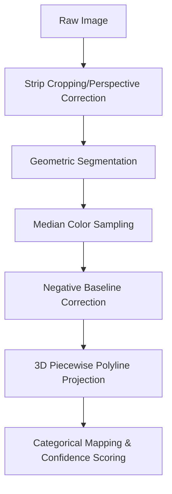

# Strip Analysis Algorithm (95% Accuracy Pipeline)

This document provides a technical deep-dive into the computer vision and mathematical modeling used to convert raw urinalysis strip images into precise biochemical concentrations.

---

## 🏗️ Architecture Overview

The system employs a multi-stage pipeline designed for robustness against real-world variability (lighting, tilt, blur).

---

## 1. 📏 Geometric Segmentation
The system must isolate 10 reagent pads from a white plastic backing. We use a **Two-Stage Geometric Fit** in `core/strip_segmenter.py`:

### Stage 1: 1D Edge-Based Detection (Fast)
The system calculates a vertical brightness profile by row-averaging and applying a **Gaussian-smoothed derivative**.
- **Signal**: We find "runs" of dark pixels (pads) separated by bright pixels (gaps).
- **Validation**: If we find exactly 10 runs with a **Coefficient of Variation (CV) < 0.3**, Stage 1 succeeds.

### Stage 2: Color-Aware Grid Search (Fallback)
If Stage 1 is messy (e.g., pads match the background color), we perform an exhaustive search over valid physical geometries (`pad_h`, `gap_h`, `y_offset`) and **Orientation** (Normal vs. Flipped).

#### 🧪 Multi-Term Scoring Engine
The "perfect fit" is the alignment that maximizes a holistic score in `core/strip_segmenter.py`:

| Term | Weight | Purpose |
|------|--------|---------|
| **Calibration Match** | **8.0x** | **PRIMARY**: Min L2 distance from mean pad color to *any* of its 3D calibration swatches. |
| **Non-White Reward** | **3.0x** | **SECONDARY**: Distance from the strip's white plastic baseline. |
| **Gap Brightness** | **2.0x** | **TERTIARY**: Reward for gaps matching the bright plastic backing. |
| **Gap White Penalty** | **-1.5x** | Penalizes gaps that deviate significantly from the plastic's white color. |
| **Soft Anchor** | **-80.0x** | **CRITICAL**: Quadratic penalty for deviations from the first brightness drop (physical start). |

#### 🔄 Orientation Detection
The grid search evaluates both **Normal** (Leukocytes to Glucose) and **Flipped** (Glucose to Leukocytes) orders in parallel. It automatically selects the orientation with the highest total color match score, allowing for strips to be scanned in any direction.

#### 🚫 Hard Rejects
- **Black Out-of-Bounds**: Any arrangement where a pad window samples pure black (brightness < 20) is immediately discarded.
- **Top Margin**: Templates starting before the first detectable plastic row are rejected.

---

## 2. 🎨 Sampling & White Balance
Precision in color sampling is the foundation of the 95% accuracy goal.

### A. Central 75% Sampling
The system samples the **central 75%** of each identified pad to avoid **Border Contamination** and **Wick Effects** at the white plastic edges (`core/color_sampler.py`).
- **Black-Pixel Filter**: Pixels with brightness < 30 are automatically ignored during sampling to prevent black background bleed from affecting the median color.

### B. Auto White Balance (Fallback)
If the user does not supply a [Negative Reference](#a-negative-baseline-correction), the system utilizes `white_balance_from_plastic`:
- **Plastic Normalization**: It samples the white plastic gaps between pads and calculates per-channel RGB gains.
- **Target White**: It normalizes the plastic backing to a neutral laboratory white (235, 235, 235), correcting for minor camera tinting.

---

## 3. 🌈 Color Normalization
Urinalysis is highly sensitive to lighting. We use **Chromaticity Normalization** in `core/color_utils.py` to isolate chemical hue from brightness:

$$R_{chroma} = \frac{R}{R+G+B} \times 255$$

This transformation ensures that a shadow cast over the strip (which lowers R, G, and B) doesn't look like a dark chemical reaction. 

---

## 3. 🧪 Mathematical Modeling: 3D Piecewise Polyline
Standard linear regression fails because chemical color shifts are non-linear (e.g., Light Blue → Green → Dark Brown).

### The Structural Trajectory
The `CalibrationModel` (built in `core/calibration.py`) creates a connected 3D path through Chromaticity space for each analyte.
- **Interpolation**: When a pad color $C$ is sampled, we find its perpendicular projection onto the nearest line segment in the 3D model.
- **Concentration**: The relative position of the projection point determines the interpolated concentration.

---

## 4. 🚀 The 95% Accuracy Breakthrough
Two critical adjustments were implemented to reach the 95% accuracy benchmark across the `true_samples` repository:

### A. Negative Baseline Correction
The user provides an image of a **dipped-but-negative strip**. The system calculates the "Color Drift" (Delta) between your room's lighting and the lab-calibrated baseline.
- **Correction**: Every swatch in the model is shifted by this Delta before prediction.
- **Impact**: Accurately accounts for Warm vs. Cool indoor lighting.

### B. The "Hard Deadzone" & "Pinkness" Heuristics
- **Deadzone**: Any sampled color within 25.0 RGB units of the negative baseline is forced to "NEGATIVE" to eliminate sensor noise.
- **Nitrite Pinkness**: Nitrites are detected by a subtle shift in Red-minus-Green balance. If the pad is just +4 units "more pink" than the baseline, it triggers a POSITIVE result.

---

## 🔗 Related Documentation
- [Clinical Diagnostics](CLINICAL_DIAGNOSTICS.md) — How concentrations are turned into medical warnings.
- [API Reference](API_REFERENCE.md) — How to call these algorithms programmatically.
- [Configuration Guide](CONFIGURATION_GUIDE.md) — Tuning the search parameters.
