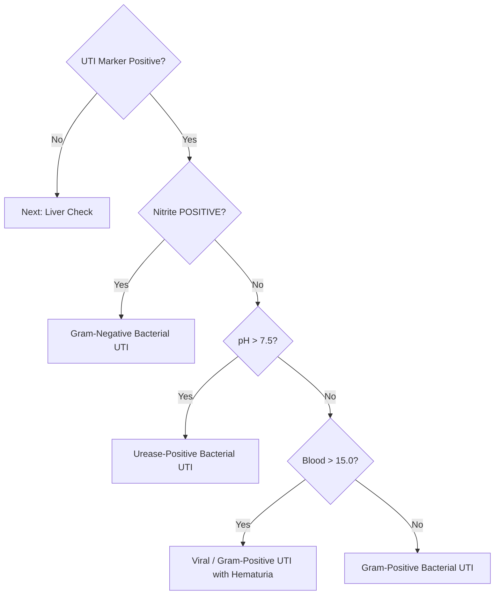

# Clinical Decision Tree (Quantified)

This document provides a detailed breakdown of the mathematical thresholds and logic paths used by the `api/clinical_classifier.py` engine to generate diagnostic warnings.

---

## 📊 Biomarker Thresholds

The following table lists the specific markers and numerical values used to trigger diagnostic alerts.

| Marker | Unit | Threshold | Rationale |
| :--- | :--- | :--- | :--- |
| **Leukocytes** | cells/uL | `> 10.0` | Indicates inflammation/pyuria. |
| **Nitrite** | Categorical | `"POSITIVE"` | Indicates bacterial nitrate reductase activity. |
| **pH** | pH units | `> 7.5` | Indicates alkaline urine (often urease-producing bacteria). |
| **Blood** | cells/uL | `> 15.0` | Indicates hematuria. |
| **Protein** | g/L | `> 0.3` | Indicates clinically significant proteinuria (> Trace). |
| **Specific Gravity** | SG | `> 1.025` | Indicates highly concentrated urine. |
| **Bilirubin** | umol/L | `> 0` | Any detectable bilirubin is abnormal. |
| **Urobilinogen** | umol/L | `> 2.0` | Suggestive of hepatic pathology or hemolysis. |

---

## 🌲 Decision Logic Flow

The diagnostic engine evaluates results in the following priority order:

### 1. Urinary Tract Infection (UTI) Pipeline
Starts if any primary UTI marker is positive: `Leukocytes > 10.0` OR `Nitrite == "POSITIVE"` OR `pH > 7.5`.

### 2. Liver & Biliary Screen
Evaluated independently of the UTI pipeline.

*   **Bilirubinuria**: Triggered if `Bilirubin > 0`.
*   **Elevated Urobilinogen**: Triggered if `Urobilinogen > 2.0`.
*   **Biliary Obstruction Pattern**: Triggered if `Urobilinogen == 0` AND `Bilirubin > 0`.

### 3. Renal & Kidney Function
*   **Renal Disease**: Triggered if `Protein > 0.3 g/L`. This threshold captures values higher than "Trace" to avoid false positives from dehydration or exercise.

### 4. Systemic Status
*   **Dehydration**: Triggered if `Specific Gravity > 1.025`.

---

## ⚖️ Normal Baseline
If **no** indicators are triggered across any of the pathways above, the system returns a "Normal" status:
> "Normal - No significant pathogenic biomarker combinations detected."

---

> [!TIP]
> **Implementation Note:** The numerical values are derived from the `models/model.json` calibration. If you update the calibration swatches, ensure the code thresholds in `api/clinical_classifier.py` still align with the desired medical logic.
