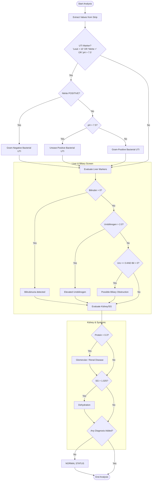

# Clinical Decision Tree (Quantified)

This document provides a detailed breakdown of the mathematical thresholds and logic paths used by the `api/clinical_classifier.py` engine to generate diagnostic warnings.

---

## 📊 Biomarker Thresholds

The following table lists the specific markers and numerical values used to trigger diagnostic alerts.

| Marker | Unit | Threshold | Rationale |
| :--- | :--- | :--- | :--- |
| **Leukocytes** | cells/uL | `> 10.0` | Indicates inflammation/pyuria. |
| **Nitrite** | Categorical | `"POSITIVE"` | Indicates bacterial nitrate reductase activity. |
| **pH** | pH units | `> 7.5` | Indicates alkaline urine (often urease-producing bacteria). |
| **Protein** | g/L | `> 0.3` | Indicates clinically significant proteinuria (> Trace). |
| **Specific Gravity** | SG | `> 1.025` | Indicates highly concentrated urine. |
| **Bilirubin** | umol/L | `> 0` | Any detectable bilirubin is abnormal. |
| **Urobilinogen** | umol/L | `> 2.0` | Suggestive of hepatic pathology or hemolysis. |

---

## 🌲 Diagnostic Flowchart

The screening engine evaluates results in a sequential pipeline. Multiple diagnoses can be triggered simultaneously if multiple conditions are met.

---

## ⚖️ Path Descriptions

### 1. Urinary Tract Infection (UTI) Pipeline
- **Gram-Negative Bacterial UTI**: Triggered by Nitrite detection.
- **Urease-Positive Bacterial UTI**: Triggered by alkaline pH (> 7.5), suggesting organisms like *Proteus*.
- **Gram-Positive Bacterial UTI**: Triggered by pyuria (Leukocytes > 10) without Nitrite or pH elevation.

### 2. Liver & Biliary Screen
- **Bilirubinuria**: Any positive Bilirubin result.
- **Elevated Urobilinogen**: Values > 2.0 umol/L.
- **Biliary Obstruction Pattern**: The combination of Bilirubinuria with absent Urobilinogen.

### 3. Renal & Systemic Status
- **Renal Disease**: Proteinuria (> 0.3 g/L) suggests glomerular damage.
- **Dehydration**: High Specific Gravity (> 1.025) suggests concentrated urine.

---

> [!TIP]
> **Unit Consistency:** The numerical thresholds match the `models/model.json` units exactly. If you update the swatches in the model, verify that these logical cutoffs remain clinically valid for your training set.
